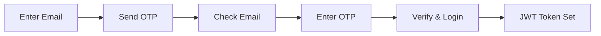

# School Management System

A comprehensive Next.js application for managing school data with robust authentication, admin controls, and MySQL database integration.

## 🚀 Features

### Core Functionality
- **Add School**: Secure form to input and store school information with validation
- **View Schools**: Display schools in a responsive card-based layout
- **Image Upload**: Store school images securely using Cloudinary
- **Form Validation**: Comprehensive validation using React Hook Form

### 🔐 Authentication System
- **Email OTP Authentication**: Secure 6-digit OTP verification via email
- **JWT Token Management**: HTTP-only cookies for secure session handling
- **Route Protection**: Authenticated-only access to school management
- **Auto Session Management**: Persistent login with automatic validation

### 👑 Admin Features
- **Role-Based Access Control**: Admin permissions based on environment configuration
- **Delete Functionality**: Admin-only school deletion with confirmation
- **Admin Status Indicators**: Clear visual feedback for admin privileges
- **Secure Admin Detection**: Environment-based admin email validation

### 🎨 User Experience
- **Responsive Design**: Perfect experience on desktop, tablet, and mobile
- **Modern UI**: Clean Tailwind CSS design with smooth animations
- **Professional Logout**: Elegant logout button with icon and hover effects
- **Loading States**: Comprehensive loading indicators throughout the app
- **Error Handling**: User-friendly error messages and validation feedback

## 🛠 Technology Stack

- **Frontend**: Next.js 14 with TypeScript and App Router
- **Styling**: Tailwind CSS with custom components
- **Authentication**: JWT tokens with HTTP-only cookies
- **Email Service**: Nodemailer with Gmail SMTP
- **Form Management**: React Hook Form with validation
- **Database**: MySQL with connection pooling
- **Image Storage**: Cloudinary integration
- **Security**: bcryptjs for password hashing, OTP verification
- **Deployment**: Vercel ready with environment configuration

## 📁 Project Structure

```
src/
├── app/
│   ├── addSchool/          # Protected: Add school form page
│   │   └── page.tsx
│   ├── showSchools/        # Public: Display schools page
│   │   └── page.tsx
│   ├── login/              # Authentication page
│   │   └── page.tsx
│   ├── api/
│   │   ├── auth/           # Authentication API routes
│   │   │   ├── send-otp/   # Send OTP endpoint
│   │   │   ├── verify-otp/ # Verify OTP & login
│   │   │   ├── check/      # Check auth status
│   │   │   └── logout/     # Logout endpoint
│   │   └── schools/        # School management API
│   │       └── route.ts    # CRUD operations with auth
│   ├── globals.css         # Global styles with Tailwind
│   ├── layout.tsx          # Root layout with AuthProvider
│   └── page.tsx           # Home page with auth status
├── lib/
│   ├── database.ts         # MySQL connection utility
│   ├── auth.ts             # Authentication utilities & JWT
│   └── AuthContext.tsx     # React Context for auth state
```

## ⚡ Quick Setup

### 1. Install Dependencies
```bash
npm install
```

### 2. Environment Configuration
Create `.env.local` with the following variables:
```env
# Database Configuration
DB_HOST=your_mysql_host
DB_PORT=3306
DB_USER=your_username
DB_PASSWORD=your_password
DB_NAME=your_database_name

# JWT Authentication
JWT_SECRET=your_super_secret_jwt_key_at_least_32_characters

# Email Configuration (Gmail SMTP)
EMAIL_USER=your-email@gmail.com
EMAIL_PASS=your-app-password

# Admin Configuration
ADMIN_EMAIL=admin@yourdomain.com

# Image Upload (Cloudinary)
CLOUDINARY_CLOUD_NAME=your_cloud_name
CLOUDINARY_API_KEY=your_api_key
CLOUDINARY_API_SECRET=your_api_secret
```

### 3. Database Setup
Create the required tables in your MySQL database:

```sql
-- Schools table
CREATE TABLE schools (
    id INT AUTO_INCREMENT PRIMARY KEY,
    name TEXT NOT NULL,
    address TEXT NOT NULL,
    city TEXT NOT NULL,
    state TEXT NOT NULL,
    contact VARCHAR(20) NOT NULL,
    image TEXT,
    email_id VARCHAR(255) NOT NULL,
    created_at TIMESTAMP DEFAULT CURRENT_TIMESTAMP,
    updated_at TIMESTAMP DEFAULT CURRENT_TIMESTAMP ON UPDATE CURRENT_TIMESTAMP
);

-- Authentication tables
CREATE TABLE otp_verifications (
    id INT AUTO_INCREMENT PRIMARY KEY,
    email VARCHAR(255) NOT NULL,
    otp VARCHAR(6) NOT NULL,
    expires_at DATETIME NOT NULL,
    created_at TIMESTAMP DEFAULT CURRENT_TIMESTAMP,
    INDEX idx_email_otp (email, otp),
    INDEX idx_expires_at (expires_at)
);

CREATE TABLE authenticated_users (
    id INT AUTO_INCREMENT PRIMARY KEY,
    email VARCHAR(255) NOT NULL UNIQUE,
    last_login TIMESTAMP DEFAULT CURRENT_TIMESTAMP ON UPDATE CURRENT_TIMESTAMP,
    created_at TIMESTAMP DEFAULT CURRENT_TIMESTAMP
);
```

### 4. Gmail SMTP Setup
1. Enable 2-Factor Authentication on your Gmail account
2. Generate an App Password: Google Account → Security → App passwords
3. Use your Gmail address as `EMAIL_USER` and app password as `EMAIL_PASS`

### 5. Cloudinary Setup
1. Create account at [Cloudinary](https://cloudinary.com/)
2. Get your cloud name, API key, and API secret from dashboard
3. Add to environment variables

### 6. Start Development Server
```bash
npm run dev
```

Visit `http://localhost:3000` to use the application.

## 📱 Pages Overview

### 🏠 Home Page (`/`)
- **Public Access**: Welcome page with navigation
- **Authenticated Users**: Shows login status and admin badge
- **Professional Design**: Side-by-side action buttons with enhanced styling
- **Smart Navigation**: Responsive layout with logout functionality

### 🔐 Login Page (`/login`)
- **Two-Step Process**: Email → OTP verification
- **Email OTP System**: 6-digit code valid for 10 minutes
- **Admin Detection**: Special welcome message for admin users
- **Security Features**: Rate limiting and validation
- **Responsive Design**: Clean mobile-first interface

### ➕ Add School (`/addSchool`)
- **Protected Route**: Requires authentication
- **Comprehensive Form**: All school details with validation
- **Image Upload**: Cloudinary integration with preview
- **Real-time Validation**: Instant feedback using React Hook Form
- **Error Handling**: User-friendly error messages

### 📋 Show Schools (`/showSchools`)
- **Public Access**: Anyone can view schools
- **Card Layout**: Responsive grid with school information
- **Admin Features**: Delete functionality for admin users only
- **Interactive Design**: Hover effects and smooth transitions
- **Mobile Optimized**: Perfect experience on all devices

## 🔧 API Endpoints

### Authentication APIs
- `POST /api/auth/send-otp` - Send OTP to email
- `POST /api/auth/verify-otp` - Verify OTP and login
- `GET /api/auth/check` - Check authentication status
- `POST /api/auth/logout` - Logout user

### School Management APIs
- `GET /api/schools` - Fetch all schools (public)
- `POST /api/schools` - Add new school (authenticated only)
- `DELETE /api/schools?id={id}` - Delete school (admin only)

## 🔐 Authentication Flow

### 1. User Registration/Login


### 2. Route Protection
- **Public Routes**: `/`, `/showSchools`, `/login`
- **Protected Routes**: `/addSchool`
- **Admin Only**: Delete functionality in `/showSchools`

### 3. Admin System
- Admin status determined by `ADMIN_EMAIL` environment variable
- Admin users get delete permissions
- Special UI indicators for admin status
- Case-insensitive email matching

## 🎨 Design Features

### Modern UI Components
- **Professional Buttons**: Hover effects and transitions
- **Card-Based Layout**: Clean, organized information display
- **Loading States**: Skeleton loading and spinners
- **Responsive Grid**: Adapts to all screen sizes
- **Icon Integration**: SVG icons for better UX

### Color Scheme
- **Primary**: Blue (#2563eb) for main actions
- **Success**: Green (#059669) for positive actions
- **Warning**: Red (#dc2626) for delete actions
- **Neutral**: Gray scales for backgrounds and text

## 🚀 Deployment

### Vercel (Recommended)
1. Connect GitHub repository to Vercel
2. Add environment variables in Vercel dashboard
3. Deploy automatically on push to main branch

### Environment Variables for Production
Ensure all environment variables from `.env.local` are configured in your deployment platform:
- Database credentials
- JWT secret (use a strong 32+ character secret)
- Email configuration
- Admin email
- Cloudinary credentials

### Database Considerations
- Use connection pooling for production
- Implement database backups
- Monitor connection limits
- Consider database scaling

---

## 🔧 Development

### Key Dependencies
```json
{
  "next": "^14.0.0",
  "react": "^18.0.0",
  "typescript": "^5.0.0",
  "tailwindcss": "^3.0.0",
  "mysql2": "^3.0.0",
  "jsonwebtoken": "^9.0.0",
  "nodemailer": "^6.0.0",
  "cloudinary": "^1.0.0",
  "react-hook-form": "^7.0.0"
}
```

### Security Features
- **JWT Tokens**: HTTP-only cookies prevent XSS
- **OTP Verification**: 10-minute expiry with cleanup
- **Input Validation**: Server-side validation for all inputs
- **CORS Protection**: Proper API route protection
- **Admin Verification**: Environment-based admin detection

---

**🎉 Feature-Complete School Management System with Enterprise-Grade Authentication** ✨

### Recent Updates (v2.0)
- ✅ Complete authentication system with email OTP
- ✅ Admin role-based access control
- ✅ Professional UI redesign with improved spacing
- ✅ Cloudinary integration for image uploads
- ✅ Enhanced security with JWT tokens
- ✅ Mobile-responsive design improvements
- ✅ Comprehensive error handling and loading states
